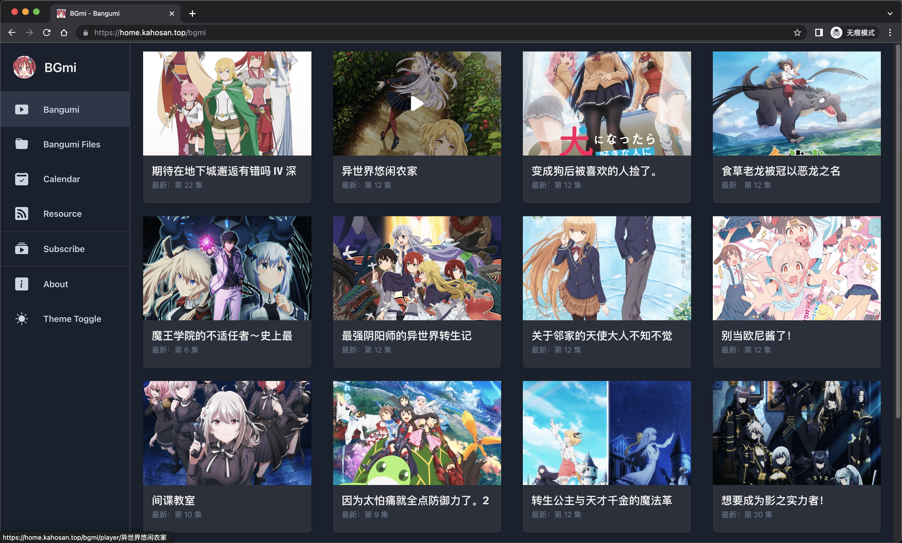
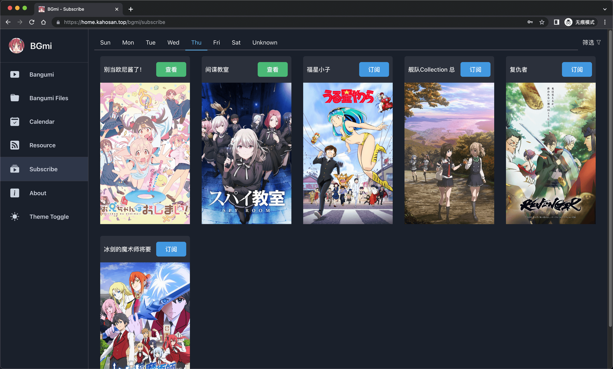

<h1 align="center">BGmi Frontend</h1>




## 项目配置

### 安装

```bash
git clone github.com/kahosan/BGmi-frontend.git

cd BGmi-frontend && pnpm install
```

### 部署

**部署前请先将 bgmi 的 `serve_static_files` 设置为 `true` 并执行 `bgmi cal --download-cover`**

```bash
pnpm build && mv front_static ~/.bgmi
```

### 配置 NGINX

```nginx
server {
  listen 80;

  autoindex on;
  sendfile on;
  charset utf-8;

  # 动画片存放目录
  location /bangumi {
    # ~/.bgmi/bangumi/
    alias /data/bangumi;
  }

  location / {
    proxy_pass http://127.0.0.1:8888/;
  }
}
```

如果你想使用网站的子域名, 按照如下配置

```nginx
server {
  listen 80;

  autoindex on;
  sendfile on;
  charset utf-8;

  location /bgmi/bangumi {
    # ~/.bgmi/bangumi/
    alias /data/bangumi;
  }

  location /bgmi/api/ {
    proxy_pass http://127.0.0.1:8888/api/;
  }

  location /bgmi/resource/ {
    proxy_pass http://127.0.0.1:8888/resource/;
  }

  location /bgmi/ {
    alias /home/user/.bgmi/front_static/;
  }
}
```

## 欢迎 PR
